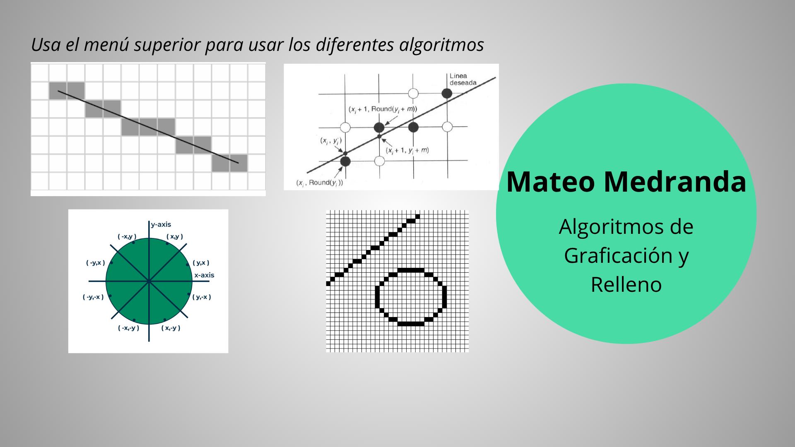
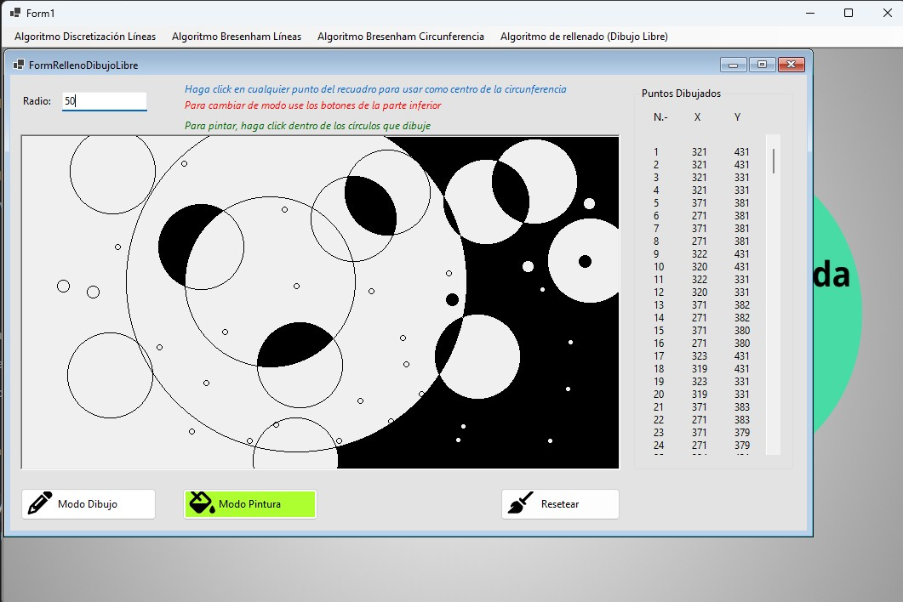

# draw_algorithms
This is a project with some of the algorithms to draw lines, circles and fill the circles with black color
The algorthms of this project are:
- DDA
- Bresenham Lines
- Bresenham Circle
- FloodFill Algorithm

  

📁 Aprende el funcionamiento de los algoritmos que deciden qué pixeles de la pantalla se deben pintar

📁 Usa tu creatividad

  
